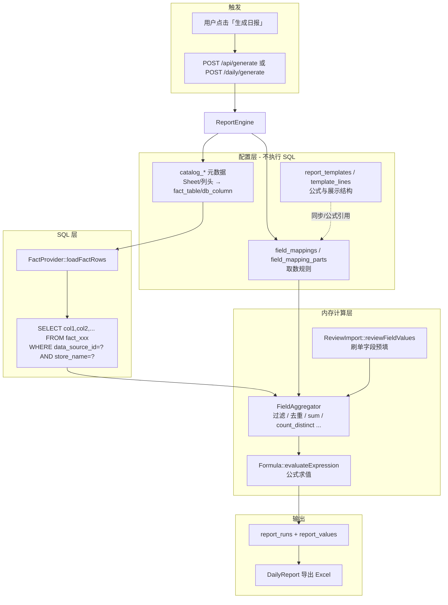

# PHP 后端：报表模板、取数规则与 SQL 实现说明

> 面向研发。说明 `php-backend/` 中「报表模板 → 查库 → 出报」的真实实现。
> 与 Python 版逻辑对等，共用同一套 MySQL 表结构。
>
> 相关文档：
> - [字段映射与取数实现](./字段映射与取数实现.md) — 通用取数原理（语言无关）
> - [技术架构](./技术架构.md) — 全栈概览（以 Python 版为主）
> - [php-backend/README.md](../php-backend/README.md) — PHP 版启动与迁移清单

---

## 1. 核心结论（先读这段）

**PHP 后端不会把「报表模板」翻译成动态 SQL。**

实际分工如下：

| 层级 | 存什么 | 是否生成 SQL |
|------|--------|--------------|
| `report_templates` + `template_lines` | 指标名称、公式表达式、展示格式 | 否 |
| `field_mappings` + `field_mapping_parts` | 从哪张表/哪列取数、怎么过滤/聚合 | 否（只描述规则） |
| `catalog_files` / `catalog_sheets` / `catalog_columns` | Excel 概念 → MySQL 事实表名与列名 | 否（元数据） |
| `FactProvider` | 按 Catalog 执行固定模式的 `SELECT` | **是（唯一查业务数据的 SQL）** |
| `FieldAggregator` | 在 PHP 内存里过滤、去重、聚合 | 否 |
| `Formula` | 对聚合结果做四则运算 | 否 |

一句话：**SQL 只负责把事实表整表拉进内存；模板和映射配置决定拉完之后怎么算。**

---

## 2. 整体数据流



---

## 3. 各层职责详解

### 3.1 报表模板（`report_templates` / `template_lines`）

**作用**：定义日报「长什么样」——有哪些指标行、每行用什么公式、怎么格式化。

**不负责**：指定查哪张表、哪条 SQL、哪个 WHERE 条件。

美宠 Demo 初始化时，`MeichongRules::seedMeichongTemplate()` 写入模板行，例如：

| sort_order | label | expression | format_type |
|------------|-------|------------|-------------|
| 1 | 实际支付金额 | `{field:mc_actual_payment}` | usd |
| 2 | 应支付金额 | `={field:mc_actual_payment}+{field:mc_payment_platform_discount}+{field:mc_sku_platform_discount}` | usd |
| 4 | 退单金额 | `={field:mc_cancelled_amount}+{field:mc_refunded_amount}` | usd |

对应代码：`php-backend/src/Services/MeichongRules.php`

启动时 `ReportLineSync::syncReportLines()` 会把模板行**同步**到 `field_mappings`，因此当前 Demo 日常出报以 **`field_mappings` 为准**，模板表主要保留历史兼容与概览页展示。

---

### 3.2 字段映射（`field_mappings` / `field_mapping_parts`）

**作用**：描述「某个逻辑字段如何从原始数据取值」——这是取数的真正配置。

一条 `field_mapping` 可有多条 `field_mapping_part`，每条 part 回答：

1. **从哪取？** `source_file_keyword` + `sheet_name` + `column_header`
2. **取哪些行？** `date_filter_column`、`row_filters`、`exclude_sample`、`exclude_review`、`join_to_orders`
3. **怎么汇总？** `aggregation`（sum / sum_dedup / count_distinct …）、`dedup_keys`
4. **与上一条怎么合？** `combine_op`（add / subtract）

示例（`mc_actual_payment` 实际支付金额）：

```
source_file_keyword: 订单
sheet_name:          OrderSKUList
column_header:       Order Amount
aggregation:         sum_dedup
dedup_keys:          [Order ID]
date_filter_column:  Created Time
date_format:         us
exclude_sample:      true
exclude_review:      true
```

读取入口：`MappingRepo::forDataSource()` → `php-backend/src/Services/MappingRepo.php`

---

### 3.3 Catalog 元数据（`catalog_*`）

ETL 导入 Excel 后，系统在 Catalog 中登记「Excel 世界」与「MySQL 世界」的映射：

| 表 | 关键字段 | 含义 |
|----|----------|------|
| `catalog_files` | `file_name`, `data_source_id` | 哪个 Excel 文件 |
| `catalog_sheets` | `sheet_name`, **`fact_table`** | 哪个 Sheet，对应哪张事实表 |
| `catalog_columns` | `header_name`, **`db_column`**, `column_aliases` | Excel 列头 → DB 列名 |

查询入口：`CatalogResolver`、`SchemaService` → `php-backend/src/Services/CatalogResolver.php`

**`fact_table` 示例**：`fact_meichong_order_skulist`（由 ETL 脚本创建并灌数，非运行时动态建表）。

---

### 3.4 SQL 执行：`FactProvider::loadFactRows()`

**文件**：`php-backend/src/Services/FactProvider.php`

这是唯一向业务事实表发 SQL 的地方。流程：

**Step 1 — 查 Catalog（元数据 SQL）**

```sql
SELECT cs.id AS sheet_id, cs.sheet_name, cs.fact_table, cf.id AS file_id, cf.file_name
FROM catalog_sheets cs
JOIN catalog_files cf ON cs.file_id = cf.id
WHERE cf.data_source_id = ? AND cf.is_active = 1 AND cs.is_active = 1
```

**Step 2 — 查列映射**

```sql
SELECT header_name, db_column, column_aliases
FROM catalog_columns
WHERE sheet_id = ? AND is_active = 1
```

**Step 3 — 按事实表整表 SELECT（业务数据 SQL）**

对每个 `fact_table`，拼出：

```sql
SELECT `id`, `order_amount`, `created_time`, ...
FROM `fact_meichong_order_skulist`
WHERE data_source_id = ? AND store_name = ?
```

注意：

- **没有** `GROUP BY`、`SUM()`、`COUNT(DISTINCT …)` — 聚合不在 SQL 层
- **没有** 按报表日期、`exclude_sample` 等条件 — 过滤在 PHP 内存完成
- 查询结果会把 `db_column` 还原为 Excel 列头（如 `Order Amount`、`Created Time`），供 `FieldAggregator` 按配置名匹配

返回结构（每行）：

```php
[
    'data_import_id' => 5,
    'sheet_name'     => 'OrderSKUList',
    'row_data'       => ['Order Amount' => '29.99', 'Created Time' => '06/22/2026', ...],
]
```

---

### 3.5 内存聚合：`FieldAggregator`

**文件**：`php-backend/src/Services/FieldAggregator.php`

在 `ReportEngine::aggregateFieldValues()` 中，对 `FactProvider` 拉回的数万行数据做：

| 步骤 | 方法 | 说明 |
|------|------|------|
| 构建日报上下文 | `buildDailyContext()` | 确定当日有效订单、样品单 ID、刷单 ID、关联键集合 |
| 按 part 过滤行 | `filterRows()` | sheet、文件名关键字、日期列、行条件、样品/刷单排除 |
| 按 part 聚合 | `aggregateRows()` | sum / count_distinct / sum_dedup / max_dedup / avg |
| 多 part 组合 | `combineParts()` | 加减合并 |
| 字段复用 | `resolvePartValue()` + `ref_field_code` | 引用已算出的其他逻辑字段 |

产出：`field_values` 字典，例如：

```php
[
    'mc_actual_payment' => 6465.23,
    'mc_sku_platform_discount' => 54.78,
    'mc_review_amount' => 100.0,   // 来自 config.review_orders 预填
    // ...
]
```

刷单相关 5 个字段由 `ReviewImport::reviewFieldValues()` 从 `data_sources.config.review_orders` 汇总，不查事实表。

---

### 3.6 公式求值：`Formula`

**文件**：`php-backend/src/Services/Formula.php`

`field_mappings` / `template_lines` 上的 `expression` 在此求值：

| 表达式类型 | 示例 | 处理 |
|------------|------|------|
| 字段引用 | `{field:mc_actual_payment}` | 直接取 `field_values['mc_actual_payment']` |
| 算术公式 | `={field:a}+{field:b}` | 安全四则运算（自定义 `ArithmeticParser`） |

结果经 `Formula::formatValue()` 格式化为 `$6,465.23`、`237` 等展示值。

---

## 4. 出报入口与两条路径

**入口**：`ReportEngine::generateReport()` / `generateReportForDataSource()`  
**文件**：`php-backend/src/Services/ReportEngine.php`

### 路径 A（当前 Demo 主路径）：按数据源配置出报

条件：`field_mappings` 中已有 `sort_order > 0` 的报表行。

```
generateReportForDataSource()
  → aggregateFieldValues()          // FactProvider + FieldAggregator
  → MappingRepo::forDataSource()    // 读报表行
  → Formula::evaluateExpression()   // 每行公式
  → INSERT report_runs / report_values
```

`template_id` 仅作为关联字段写入 `report_runs`，**不参与取数逻辑**。

### 路径 B（旧版兼容）：无 field_mappings 时按 template_lines 出报

条件：数据源尚未配置报表行。

```
generateReport()
  → aggregateFieldValues()          // 取数逻辑相同
  → SELECT * FROM template_lines    // 读模板公式
  → Formula::evaluateExpression()
  → INSERT report_runs / report_values
```

美宠 Demo 已有完整 `field_mappings`，实际总是走路径 A。

---

## 5. 完整调用链（以「生成日报」为例）

```
浏览器 POST /daily/generate
  └─ PagesController::dailyGenerate()
       └─ ReportEngine::generateReportForDataSource(dsId, reportDate, storeName)
            ├─ aggregateFieldValues()
            │    ├─ DsSettings::getDsConfig()           // 日期主表、刷单清单等
            │    ├─ FactProvider::loadFactRows()        // ★ 执行 SQL，拉事实表
            │    ├─ FieldAggregator::buildDailyContext()
            │    ├─ ReviewImport::reviewFieldValues()   // 刷单字段预填
            │    ├─ MappingRepo::forDataSource()        // 读 field_mapping_parts
            │    └─ FieldAggregator::resolvePartValue() // 内存过滤+聚合
            ├─ MappingRepo::forDataSource()             // 报表展示行
            ├─ Formula::evaluateExpression()            // 每指标公式
            └─ Database::insert('report_runs' / 'report_values')
```

API 路径 `POST /api/generate` 逻辑相同，由 `ApiController::generate()` 调用同一套 `ReportEngine`。

---

## 6. 与「传统报表 SQL」的对比

| 维度 | 传统 BI / 报表 SQL | AutoReport PHP 后端 |
|------|-------------------|---------------------|
| 指标定义 | 写在 SQL 或存储过程里 | 存在 `field_mappings` + 公式 expression |
| 查库方式 | 每个指标一条 SQL | 每个事实表一条 `SELECT`（整表） |
| 过滤/聚合 | `WHERE` / `GROUP BY` / 窗口函数 | PHP `FieldAggregator` 内存计算 |
| 列头变更 | 改 SQL | 改 `catalog_columns` 或映射 aliases |
| 优点 | 大数据量下 DB 端聚合更高效 | 配置驱动、口径变更无需改代码/SQL |
| 当前局限 | — | 事实表全量加载，数据量极大时需改为 DB 端聚合或分区 |

---

## 7. 关键源码索引

| 模块 | 路径 | 职责 |
|------|------|------|
| 出报引擎 | `php-backend/src/Services/ReportEngine.php` | 组织取数、公式、落库 |
| 事实表加载 | `php-backend/src/Services/FactProvider.php` | **唯一业务 SQL** |
| 内存聚合 | `php-backend/src/Services/FieldAggregator.php` | 过滤、去重、聚合、组合 |
| 公式引擎 | `php-backend/src/Services/Formula.php` | `{field:code}` 解析与求值 |
| 映射仓储 | `php-backend/src/Services/MappingRepo.php` | 读 field_mappings + parts |
| Catalog | `php-backend/src/Services/CatalogResolver.php` | 元数据查询 |
| 数据源配置 | `php-backend/src/Services/DsSettings.php` | 日期主表、定时出报等 |
| 刷单导入 | `php-backend/src/Services/ReviewImport.php` | review_orders → 字段值 |
| 美宠种子规则 | `php-backend/src/Services/MeichongRules.php` | 模板行、默认映射 |
| 模板同步 | `php-backend/src/Services/ReportLineSync.php` | template_lines → field_mappings |
| API 入口 | `php-backend/src/Controllers/ApiController.php` | `/api/generate` 等 |
| 页面入口 | `php-backend/src/Controllers/PagesController.php` | `/daily/generate` 等 |

---

## 8. 实例：「实际支付金额」从配置到数值

以 `mc_actual_payment`（2026-06-22，美宠美国店）为例：

```
1. field_mapping_parts 配置
   文件关键字「订单」+ Sheet「OrderSKUList」+ 列「Order Amount」
   聚合 sum_dedup(Order ID)，日期列 Created Time，排除样品/刷单

2. catalog_sheets.fact_table
   → fact_meichong_order_skulist

3. FactProvider SQL
   SELECT id, order_amount, created_time, order_id, ...
   FROM fact_meichong_order_skulist
   WHERE data_source_id = 1 AND store_name = '平衡贴美国本土店铺'
   → 约 1.7 万行（OrderSKUList）

4. FieldAggregator（内存）
   过滤 sheet=OrderSKUList、文件名含「订单」、Created Time=2026-06-22、非样品非刷单
   按 Order ID 去重后对 Order Amount 求和
   → 6465.23

5. field_mappings.expression
   {field:mc_actual_payment}

6. Formula
   → 6465.23 → 展示 "$6,465.23"

7. report_values
   line_label=实际支付金额, display_value=$6,465.23
```

可用比对脚本复验 PHP 与 Python 结果一致：

```bash
cd php-backend
php bin/compare_runs.php 2026-06-22 <php_run_id> <python_run_id>
```

---

## 9. 常见问题

### Q1：改了报表模板公式，为什么取数没变？

模板/`field_mappings` 的 `expression` 只影响**公式层**（用哪些已聚合字段做加减）。  
真正决定「从哪张表哪列取」的是 `field_mapping_parts`，在「报表配置」弹窗里改。

### Q2：能不能给某个指标单独写一条 SQL？

当前架构**不支持**。扩展方式有两种：

1. **推荐**：继续用 `field_mapping_parts` 描述规则（与现有引擎一致）
2. **改造**：在 `FieldAggregator` 或新 Service 中为特定 `line_code` 增加 DB 端聚合分支（需改代码）

### Q3：PHP 版和 Python 版这条链路一样吗？

一样。PHP 各 Service 与 Python `app/services/` 一一对应，共用 MySQL，出报数值可对齐验证。

### Q4：没有 Catalog 时会怎样？

`FactProvider` 不走事实表，回退读 `data_imports` + `data_rows`（JSON 行数据），聚合逻辑相同。美宠生产环境走 Catalog + 事实表路径。

---

*文档版本：与 php-backend 迁移完成时对齐（Slim 4 + PDO + Twig）。*
