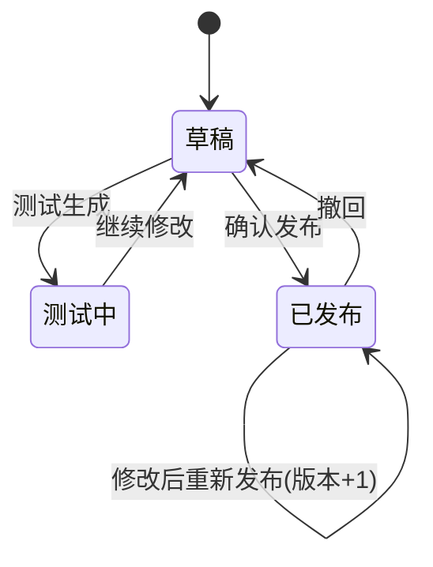

# AutoReport 产品需求文档（PRD）

| 项目 | 内容 |
|------|------|
| 产品名称 | AutoReport — 跨境电商自动经营报表平台 |
| 文档版本 | v0.1（Demo 阶段） |
| 更新日期 | 2025-06-23 |
| 状态 | Demo 已验证，待试点 |

---

## 1. 背景与问题

### 1.1 业务背景

公司拥有多家跨境电商店铺，覆盖 Amazon、Shopee 等不同平台与区域。RPA 已具备每日从各店铺下载 Excel 报表的能力，但后续数据处理仍高度依赖人工：

- 财务人员每天花费大量时间下载、打开、汇总表格
- 不同人员负责的平台/区域不同，统计口径与 Excel 公式各不相同
- 店铺导出字段（列头）经常变化，研发需频繁协助改公式、改脚本
- 报表输出格式不统一，跨人、跨店对比困难

### 1.2 核心问题

| 问题 | 影响 |
|------|------|
| 报表逻辑绑死在 Excel 文件结构上 | 列头一变，公式全废 |
| 公式由研发维护 | 财务改需求 → 排期 → 上线，周期长 |
| 无统一模板与版本管理 | 口径不一致，历史数据难追溯 |
| 无字段映射与告警机制 | 数据静默错误，发现滞后 |

### 1.3 产品目标

构建一个 **财务可自助配置、系统自动出报** 的 Web 平台：

1. 财务在 Web 页面定义报表模板（指标 + 公式）
2. 财务配置每个指标从哪个 Excel 的哪个 Sheet、哪个列头取值
3. 系统每日自动抓取/导入数据，按已发布模板生成统一口径报表
4. 列头不匹配时记录告警日志，减少静默错误
5. 研发不再参与日常报表口径变更

---

## 2. 用户与场景

### 2.1 用户角色

| 角色 | 描述 | 核心诉求 |
|------|------|----------|
| **财务专员** | 负责若干店铺的日常经营分析 | 自助改口径、快速出日报、导出给主管 |
| **财务主管** | 统管多平台/多区域 | 口径一致、可对比、可审计 |
| **研发/运维** | 维护 RPA 与系统 | 少改业务逻辑，只保障数据管道 |
| **管理员** | 系统配置与权限 | 数据源、用户、模板发布策略 |

### 2.2 典型场景

**场景 A：日常日报**

> 张财务负责 Amazon US 3 家店。每天早上 RPA 将 Excel 放入指定目录，系统自动解析入库，按她已经 **发布** 的「日经营报表」模板生成 3 份报表，她在 Web 上查看并导出。

**场景 B：平台列头变更**

> Amazon 将「Sales Amount」改为「Revenue」。张财务在 **字段映射** 页面为「销售额」逻辑字段增加别名 `Revenue`，或在映射日志看到告警后修改配置。**无需改报表模板公式**。

**场景 C：新增统计指标**

> 主管要求增加「广告 ROI」。张财务在报表模板中新增一行：`={field:sales_amount}/{field:ad_spend}`，测试生成确认无误后发布，次日正式报表自动包含该指标。

**场景 D：新平台接入**

> 新增 TikTok Shop 数据源。管理员注册数据源，财务配置 TikTok 专属的 Sheet/列头映射，复用同一套报表模板（逻辑字段层抽象平台差异）。

---

## 3. 产品范围

### 3.1 本期 Demo 已实现（v0.1）

| 模块 | 功能 | 状态 |
|------|------|------|
| 数据源管理 | Amazon / Shopee 示例数据源 | ✅ Demo |
| Excel 解析入库 | 上传/预置文件 → 按 Sheet 解析行数据 | ✅ Demo |
| 逻辑字段 | 销售额、订单数、广告花费等 6 个字段 | ✅ Demo |
| 字段映射 | Sheet + 列头 + 别名 + 聚合方式 | ✅ Demo（可增删改） |
| 映射告警 | 列头不匹配写 warning 日志 | ✅ Demo |
| 报表模板 | 指标行 + 公式（10 个电商 KPI） | ✅ Demo（只读展示） |
| 测试生成 | 选数据源/日期/店铺 → 预览报表 | ✅ Demo |
| 模板发布 | 草稿 → 发布 / 撤回 | ✅ Demo |
| 报表输出 | Web 查看历史报表 | ✅ Demo |

### 3.2 MVP（v1.0）目标范围

**必须做（P0）**

- [ ] 字段映射 **在线增删改**
- [ ] 报表模板指标行 **在线增删改**
- [ ] RPA 对接：监听目录 / API 自动导入（替代手动上传）
- [ ] MySQL 生产库部署
- [ ] 用户登录 + 按店铺/区域 **数据权限**
- [ ] 正式日报 **定时任务**（cron / 任务队列）
- [ ] 报表 **导出 Excel**
- [ ] 映射告警 **列表筛选 + 已读/处理状态**

**应该做（P1）**

- [ ] 模板 **版本历史**（对比、回滚）
- [ ] 多店汇总报表（同一模板批量生成）
- [ ] 邮件/企微 **告警通知**
- [ ] 导入任务看板（成功/失败/行数）
- [ ] 公式编辑器（字段 autocomplete）

**可以后做（P2）**

- [ ] 可视化 Excel 格子模板设计器（Luckysheet / Univer）
- [ ] HyperFormula 完整 Excel 函数库（VLOOKUP 等）
- [ ] ClickHouse 历史分析层
- [ ] 多币种 / 时区换算
- [ ] 与 BI 工具（Metabase）打通

### 3.3 明确不做（Out of Scope）

- 替代 RPA 抓数（数据获取已由 RPA 负责）
- 替代 ERP / 财务总账
- 首期不做复杂审批流（发布即生效，由财务自行负责）

---

## 4. 功能需求详述

### 4.1 数据源管理

**描述**：注册 RPA 产出的 Excel 数据来源，按平台/店铺区分。

| 字段 | 说明 |
|------|------|
| 名称 | 如「Amazon US 店铺」 |
| 平台 | Amazon / Shopee / … |
| 导入方式 | 目录监听 / API 上传 / 手动 |
| 文件匹配规则 | 文件名 glob，如 `amazon_*_{date}.xlsx` |

**验收标准**

- 管理员可新增/编辑/停用数据源
- 同一数据源可关联多套字段映射

---

### 4.2 数据导入与解析

**描述**：将 Excel 解析为结构化行数据存入数据库。

**流程**

```
RPA Excel → 导入服务 → 按 Sheet 读表头 + 数据行 → 写入 data_rows（JSON）
                      → 校验字段映射 → 写 mapping_logs（告警）
```

**规则**

- 支持 `.xlsx`（首期），后续扩展 `.csv`
- 首行作为列头
- 列头不匹配：**记录 warning 日志，不阻断导入**（Demo 行为，v1 可配置）
- 同一「数据源 + 日期 + 店铺」重复导入：覆盖或版本追加（v1 需定义策略）

**验收标准**

- 导入后可在「导入历史」看到文件名、行数、时间
- 解析失败有明确错误信息

---

### 4.3 逻辑字段与映射（核心）

**描述**：抽象平台差异，财务配置「取数位置」。

**概念模型**

```
逻辑字段（sales_amount / 销售额）
    └── 映射规则（按数据源）
            ├── Sheet 名：订单明细
            ├── 列头：Sales Amount
            ├── 别名：[Revenue, 销售金额]   ← 防列头漂移
            └── 聚合：sum | count | avg
```

**交互要求（v1）**

- 选择数据源 → 上传样例 Excel → **自动识别 Sheet 与列头** → 下拉绑定逻辑字段
- 支持配置多个别名
- 保存后立即生效于下次导入/出报

**验收标准**

- 修改映射后，不修改模板公式即可适配新列头
- 映射失效时，日志可定位到具体字段、Sheet、实际列头列表

---

### 4.4 报表模板

**描述**：定义输出报表的结构与计算公式，采用 **指标行模型**（行=KPI，列=单店单日值；后续扩展多列）。

**模板属性**

| 属性 | 说明 |
|------|------|
| 名称 | 如「跨境电商日经营报表」 |
| 状态 | 草稿 / 已发布 |
| 版本 | 每次发布 +1 |
| 负责人 | 维护该模板的财务 |

**指标行属性**

| 属性 | 说明 |
|------|------|
| 指标名称 | 如「ACOS」 |
| 表达式 | `{field:ad_spend}` 或 `={field:ad_spend}/{field:sales_amount}` |
| 格式 | 货币 / 百分比 / 整数 / 小数 |
| 高亮 | 是否强调展示（如净利润） |

**公式语法（v1）**

```
{field:字段代码}              直接引用逻辑字段聚合值
=算术表达式                   支持 + - * / 与字段引用
```

**Demo 内置 KPI 参考**

| 指标 | 表达式 |
|------|--------|
| 销售额 | `{field:sales_amount}` |
| 订单数 | `{field:order_count}` |
| 客单价 | `={field:sales_amount}/{field:order_count}` |
| 退款率 | `={field:refund_amount}/{field:sales_amount}` |
| ACOS | `={field:ad_spend}/{field:sales_amount}` |
| 毛利润 | `={field:sales_amount}-{field:platform_fee}-{field:ad_spend}` |
| 净利润 | `={field:sales_amount}-{field:platform_fee}-{field:refund_amount}-{field:ad_spend}` |

---

### 4.5 模板生命周期（发布流程）

**状态机**



**规则**

- **测试生成**：写入 `is_test=true` 的报表，不影响正式口径
- **发布**：仅已发布模板可用于定时正式任务；版本号递增
- **撤回**：回到草稿，定时任务暂停使用该模板

**验收标准**

- 测试报表与正式报表在 UI 上有明确标识
- 已发布模板版本号可追溯

---

### 4.6 报表生成与展示

**描述**：按模板 + 数据源 + 日期 + 店铺计算并展示。

**输入**

- 模板 ID
- 数据源 ID
- 报表日期（YYYY-MM-DD）
- 店铺编码

**输出**

- 指标名称 + 格式化数值
- 计算状态：成功 / 有告警 / 错误
- 可选：展开查看公式与原始值

**验收标准**

- 数值与财务 Excel 手算结果一致（试点店验证）
- 公式除零等异常有明确错误提示，不崩溃

---

### 4.7 映射日志

**描述**：记录列头不匹配、字段无数据等异常。

| 级别 | 场景 |
|------|------|
| warning | 期望列头在 Sheet 中不存在 |
| error | 导入失败、公式计算失败（v1） |

**日志内容**

- 时间、数据源、导入批次
- 逻辑字段、期望列头、实际列头列表
- 人类可读 message

**验收标准（Demo 已验证）**

- 上传 `amazon_us_store_drift.xlsx`（广告列头改为 Ad Spend）可产生告警

---

## 5. 信息架构（页面结构）

```
AutoReport
├── 概览 Dashboard          系统状态、快速入口、最近告警
├── 报表模板                模板列表 → 模板详情（指标行 / 测试 / 发布）
├── 字段映射                逻辑字段目录 + 各数据源映射表
├── 数据导入                上传 Excel、导入历史
├── 报表输出                报表列表 → 报表详情
└── 映射日志                告警列表与详情
```

---

## 6. 数据模型（概要）

```
data_sources          数据源（平台）
data_imports          一次导入记录
data_rows             解析后的行（sheet + JSON）
logical_fields        逻辑字段定义
field_mappings        数据源级字段映射
mapping_logs          映射告警
report_templates      报表模板
template_lines        模板指标行
report_runs           一次报表生成
report_values         报表各指标值
```

---

## 7. 非功能需求

| 类别 | 要求 |
|------|------|
| **性能** | 单店日报生成 < 5s；支持 100 店串行日批 < 30min（v1） |
| **可用性** | 财务无需培训即可理解「字段映射 → 模板 → 出报」路径 |
| **可靠性** | 日批失败可重跑；导入幂等 |
| **安全** | 登录鉴权；店铺级数据隔离 |
| **审计** | 模板发布、映射变更留操作日志（v1） |
| **部署** | Docker 化；配置库 MySQL；Demo 可用 SQLite |

---

## 8. 技术方案建议

| 层级 | Demo（当前） | 生产（建议） |
|------|-------------|-------------|
| 前端 | Jinja2 + Tailwind | Vue3 / React + 组件库 |
| 后端 | FastAPI | FastAPI |
| 配置库 | SQLite | **MySQL** |
| 分析库（可选） | — | ClickHouse（历史明细） |
| 公式引擎 | 自研轻量解析 | HyperFormula（扩展函数） |
| 任务调度 | 手动 | Celery / APScheduler / Cron |
| 文件存储 | 本地目录 | OSS / NAS |

---

## 9. 里程碑规划

| 阶段 | 时间（建议） | 交付物 |
|------|-------------|--------|
| **Demo** | 已完成 | 可演示 Web + 样例数据 + 发布流程 |
| **试点 v1** | 4–6 周 | 1 平台 3 店；映射/模板可编辑；RPA 对接；MySQL |
| **推广 v1.5** | +4 周 | 全平台映射；定时日批；导出；告警通知 |
| **增强 v2** | +8 周 | 版本对比；多店汇总；权限体系；公式编辑器 |

---

## 10. 成功指标

| 指标 | 目标 |
|------|------|
| 财务自助改口径比例 | > 90% 不再找研发 |
| 单店日报生成耗时 | 从 30min+ 人工 → < 1min 自动 |
| 列头变更修复时间 | 从 1–3 天 → 财务 10 分钟内自行配置 |
| 报表口径一致性 | 同模板同日期跨店可对比 |

---

## 11. 风险与对策

| 风险 | 对策 |
|------|------|
| 列头频繁变化 | 别名机制 + 映射告警 + 样例文件预览 |
| 公式比 Demo 复杂 | 分阶段引入 HyperFormula；复杂逻辑仍放 dbt/SQL |
| 财务误发布错误模板 | 测试生成强制习惯 + 版本回滚 |
| 数据量增大 | MySQL 存近期；ClickHouse 存历史；按日汇总表 |

---

## 12. 附录

### 12.1 Demo 启动

```bash
cd d:\Code\AutoReport
run.bat
# 访问 http://127.0.0.1:8000
```

### 12.2 Demo 体验路径

1. 概览 → 了解系统
2. 字段映射 → 查看 Amazon/Shopee 映射差异
3. 报表模板 → 测试生成（Amazon-US-001 / 2025-06-22）
4. 报表输出 → 查看 KPI
5. 发布模板
6. 数据导入 → 上传 `sample_data/amazon_us_store_drift.xlsx`
7. 映射日志 → 查看「广告花费」列头告警

### 12.3 术语表

| 术语 | 定义 |
|------|------|
| 逻辑字段 | 跨平台统一的业务指标标识，如 sales_amount |
| 字段映射 | 逻辑字段在某一数据源 Excel 中的物理位置 |
| 指标行 | 报表模板中的一行 KPI 定义 |
| 测试报表 | is_test=true，不影响正式口径 |
| 列头漂移 | 平台/export 工具变更 Excel 列名 |

---

**文档维护**：随 Demo 迭代更新，下一版 v0.2 补充原型图与接口清单。
