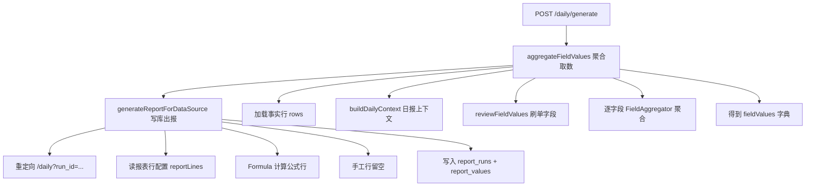

# 生成日报：流程与实现说明

> 面向研发。说明用户点击「生成日报」后，从浏览器提交到数值落库的完整链路与核心代码位置。  
> PHP 版（`php-backend/`）与 Python 版（`app/`）逻辑对等，共用 MySQL。

相关文档：

- [PHP报表取数与SQL实现](./PHP报表取数与SQL实现.md) — FactProvider / FieldAggregator / 为何不生成动态 SQL
- [字段映射与取数实现](../../docs/字段映射与取数实现.md) — 通用取数原理（语言无关）
- [README](../README.md) — 启动与目录结构

---

## 1. 一句话总结

**「生成日报」= 从 MySQL 拉出店铺全量事实行 → 按报表配置在内存里过滤/聚合出各指标 → 用公式算出日报每行数值 → 写入 `report_runs` / `report_values` → 跳转展示。**

计算在服务端**同步**完成（无 WebSocket、无前端轮询），耗时主要取决于事实表行数与字段规则数量。

---

## 2. 前端：点击按钮发生了什么

日报页（`templates/daily.html.twig`）是一个普通 HTML 表单：

```html
<form method="post" action="/daily/generate" class="flex flex-wrap items-end gap-4">
  <select name="data_source_id">...</select>
  <input type="date" name="report_date" value="2026-06-22">
  <button type="submit">生成日报</button>
</form>
```

点击后浏览器 **POST** `/daily/generate`，提交：

| 字段 | 含义 |
|------|------|
| `data_source_id` | 选中的店铺/数据源 ID |
| `report_date` | 报表日期（ISO：`Y-m-d`） |

浏览器会等待服务端算完，再跟随 302 重定向到结果页。

另有 API 入口 `POST /api/generate`（`ApiController::generate()`），内部调用同一套 `ReportEngine`，供脚本或联调使用。

---

## 3. 路由入口

**文件**：`src/Controllers/PagesController.php` → `dailyGenerate()`

```
POST /daily/generate
  1. 校验账号对该 data_source 的访问权限
  2. 从 data_sources.config.meta 读取店铺名称（缺省用 ds.name）
  3. ReportEngine::generateReportForDataSource(dsId, reportDate, storeName, isTest=true)
  4. 302 → /daily?run_id={新 run 的 id}
```

Python 对等：`app/routers/pages.py` → `daily_generate()`。

---

## 4. 整体流程（两阶段）



核心类：**`src/Services/ReportEngine.php`**

| 阶段 | 方法 | 作用 |
|------|------|------|
| ① 取数聚合 | `aggregateFieldValues()` | 从 Excel/事实表算出每个逻辑字段的数值 |
| ② 出报落库 | `generateReportForDataSource()` | 按公式组合、格式化、写入数据库 |

---

## 5. 阶段①：加载数据

```php
if (CatalogResolver::hasCatalog($dataSourceId)) {
    [$rows, $importFileNames] = FactProvider::loadFactRows($dataSourceId, $storeName);
} else {
    // 旧模式：data_imports + data_rows
}
```

### 有 Catalog（美宠 ETL 场景）

`FactProvider::loadFactRows()` 按 catalog 元数据，对每个 `fact_table` 执行固定模式 SQL：

```sql
SELECT `id`, `order_amount`, `created_time`, ...
FROM `fact_meichong_order_skulist`
WHERE data_source_id = ? AND store_name = ?
```

列按 `catalog_columns` 映射回 Excel 列头，组装为统一行结构：

```php
[
    'data_import_id' => 5,
    'sheet_name'     => 'OrderSKUList',
    'row_data'       => ['Order ID' => '...', 'Order Amount' => '29.99', ...],
]
```

### 无 Catalog

从 `data_imports` / `data_rows` 读取历史上传的 Excel 行（`row_data` 为 JSON）。

**要点**：模板与映射配置**不会**被翻译成动态 SQL；SQL 只负责整表拉取，过滤与聚合在 PHP 内存完成。详见 [PHP报表取数与SQL实现](./PHP报表取数与SQL实现.md)。

---

## 6. 阶段①：构建「日报上下文」

当数据源配置了 `config`（日期主表、样品规则等）时：

`FieldAggregator::buildDailyContext($rows, $dsConfig, $reportDate)`

在订单主表上预先计算（**文件**：`src/Services/FieldAggregator.php`、`src/Services/DailyContext.php`）：

| 上下文字段 | 含义 |
|------------|------|
| `sampleOrderIds` | 样品单 Order ID（指定列求和 ≈ 0） |
| `reviewOrderIds` | 刷单 Order ID（来自 config） |
| `validOrderKeys` / `validOrderIds` | 当日有效订单（日期=报表日、非样品、非刷单） |
| `sameDayRefundOrderIds` | 当日下单且当日退款的 Order ID |
| `validJoinMap` | 跨表关联用的有效键组合（Order ID、SKU ID 等） |

后续取数规则中的「排除样品 / 排除刷单 / 关联主表 / benchmark_keys」均依赖此上下文。

---

## 7. 阶段①：逐字段聚合 `fieldValues`

### 7.1 刷单字段（不扫事实表行）

```php
$sameDayIds = $context?->sameDayRefundOrderIds;
$fieldValues = ReviewImport::reviewFieldValues($dsConfig, $sameDayIds);
```

从 `data_sources.config.review_orders` 汇总（**文件**：`src/Services/ReviewImport.php`）：

| 内部键 | 逻辑字段 code | 计算方式 |
|--------|---------------|----------|
| amount | mc_review_amount | 按行求和 |
| commission | mc_review_commission | 按行求和 |
| service_fee | mc_review_service_fee | 按行求和 |
| cost | mc_review_cost | 按行求和 |
| logistics | mc_review_logistics | **按单固定**：去重 Order ID 数 × 每单金额（可选排除当日退单） |

### 7.2 取数字段（`line_type = fetch`）

读取 `MappingRepo::forDataSource()` 得到的 `field_mapping_parts`，对每个 **part**：

1. **`FieldAggregator::resolvePartValue()`**
   - 有 `ref_field_code` → 复用已算字段（可带 `benchmark_keys` 强制按主表关联）
   - 否则 → `aggregatePart()`：筛行后聚合
2. **`FieldAggregator::combineParts()`** — 多个 part 按 `add` / `subtract` 合并

单条 part 的筛选（`filterRows`）包括：

- Sheet 名、来源文件关键字（`source_file_keyword`）
- 日期列 = 报表日（`date_filter_column` + `date_format`）
- 行条件（`row_filters`：eq / contains / between 等）
- 排除样品、排除刷单、仅样品、关联主表（结合 DailyContext）

聚合方式（`aggregation`）：

| 值 | 含义 |
|----|------|
| `sum` | 所有匹配行求和 |
| `avg` | 平均值 |
| `count` | 行数 |
| `count_distinct` | 按 `dedup_keys` 去重计数 |
| `sum_dedup` | 每组取一个值再求和 |
| `max_dedup` | 每组取最大再求和 |

### 7.3 字段互相引用

若 part 使用 `ref_field_code` 引用其他逻辑字段，引擎会**多轮迭代**（最多 `取数字段数 + 1` 轮），直到 `fieldValues` 不再变化。

产出示例：

```php
[
    'mc_actual_payment' => 6465.23,
    'mc_sku_platform_discount' => 54.78,
    'mc_review_logistics' => 8.0,
    // ...
]
```

若有字段全为 0 且无复用引用，会记入 `warnings`，最终 `report_runs.status` 可能为 `warning`。

---

## 8. 阶段②：公式出报并写入数据库

`generateReportForDataSource()` 在聚合完成后：

1. **`reportDisplayLines()`** — 只保留已纳入日报结构的行（`sort_order > 0` 或 `report_group` 非空）；基础取数字段不出现在日报中。
2. **插入 `report_runs`** — 记录日期、店铺、`data_source_id`、`status`（success / warning / error）。
3. **逐行写入 `report_values`**：

| 行类型 | 处理 |
|--------|------|
| 手工行（`line_type = manual`） | `raw_value = null`，等财务在日报页填写 |
| 公式/取数行 | `expression` 如 `{field:mc_actual_payment}` 或 `={field:a}+{field:b}` |
| | `Formula::evaluateExpression($expr, $fieldValues)` 求值 |
| | `Formula::formatValue()` 按 `format_type`（usd / percent 等）格式化展示 |

公式解析失败时，该行显示「错误: …」，并将 run 标为 `error`。

**文件**：`src/Services/Formula.php`、`src/Services/MappingUtils.php`。

---

## 9. 结果页展示

重定向到 `GET /daily?run_id=123` 后，`PagesController::daily()`：

1. 读取 `report_runs`、`report_values`
2. `DailyReport::buildDynamicReportRows()` 拼表格（列字母、系统计算值、是否可编辑等）
3. Twig 渲染 `daily.html.twig`

用户在页面上修改报表值时，由 `daily_editor.js` 调用 `/api/report-values` **只更新已落库的值**，**不会**重新跑整套聚合。修改取数规则或需按新口径重算时，须再次点击「生成日报」。

---

## 10. 定时任务

`bin/scheduler.php` 在计划任务触发时调用同一 `ReportEngine::generateReportForDataSource()`，仅 `is_test = false`，计算逻辑与手动生成一致。

---

## 11. 完整调用链（速查）

```
浏览器 POST /daily/generate
  └─ PagesController::dailyGenerate()
       └─ ReportEngine::generateReportForDataSource()
            ├─ aggregateFieldValues()
            │    ├─ DsSettings::getDsConfig()
            │    ├─ FactProvider::loadFactRows()          ★ 业务 SQL
            │    ├─ FieldAggregator::buildDailyContext()
            │    ├─ ReviewImport::reviewFieldValues()
            │    ├─ MappingRepo::forDataSource()
            │    └─ FieldAggregator::resolvePartValue()  ★ 内存聚合
            ├─ MappingRepo::forDataSource()               报表展示行
            ├─ Formula::evaluateExpression()              每行公式
            └─ INSERT report_runs / report_values
```

---

## 12. 关键源码索引

| 模块 | 路径 |
|------|------|
| 页面入口 | `src/Controllers/PagesController.php` |
| API 入口 | `src/Controllers/ApiController.php` |
| 出报引擎 | `src/Services/ReportEngine.php` |
| 事实表加载 | `src/Services/FactProvider.php` |
| 内存聚合 | `src/Services/FieldAggregator.php` |
| 日报上下文 | `src/Services/DailyContext.php` |
| 刷单汇总 | `src/Services/ReviewImport.php` |
| 映射读取 | `src/Services/MappingRepo.php` |
| 公式引擎 | `src/Services/Formula.php` |
| 日报展示/导出 | `src/Services/DailyReport.php` |
| 路由注册 | `public/index.php` |

Python 对等目录：`app/routers/pages.py`、`app/services/report_engine.py` 等。

---

## 13. 验证 PHP 与 Python 结果一致

```bash
cd php-backend
php bin/compare_runs.php <report_date> <php_run_id> <python_run_id>
```

---

*文档版本：与 php-backend 日报出报链路对齐（含刷单按单物流费、benchmark_keys、当日退单排除）。*
